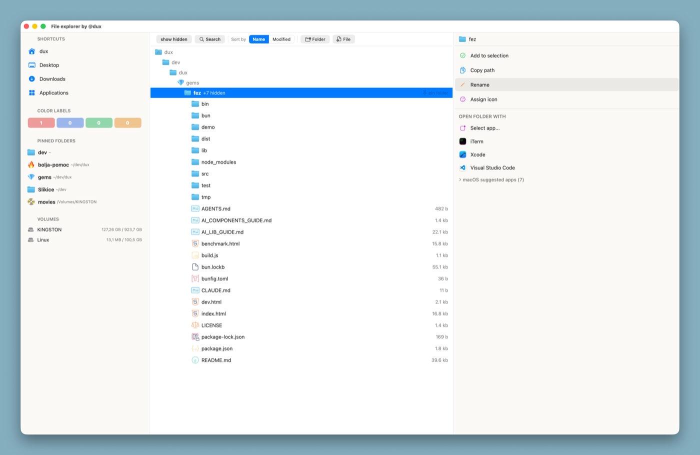
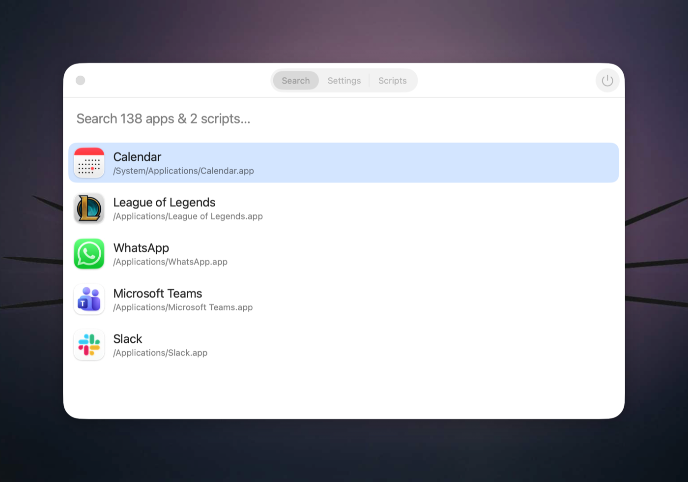
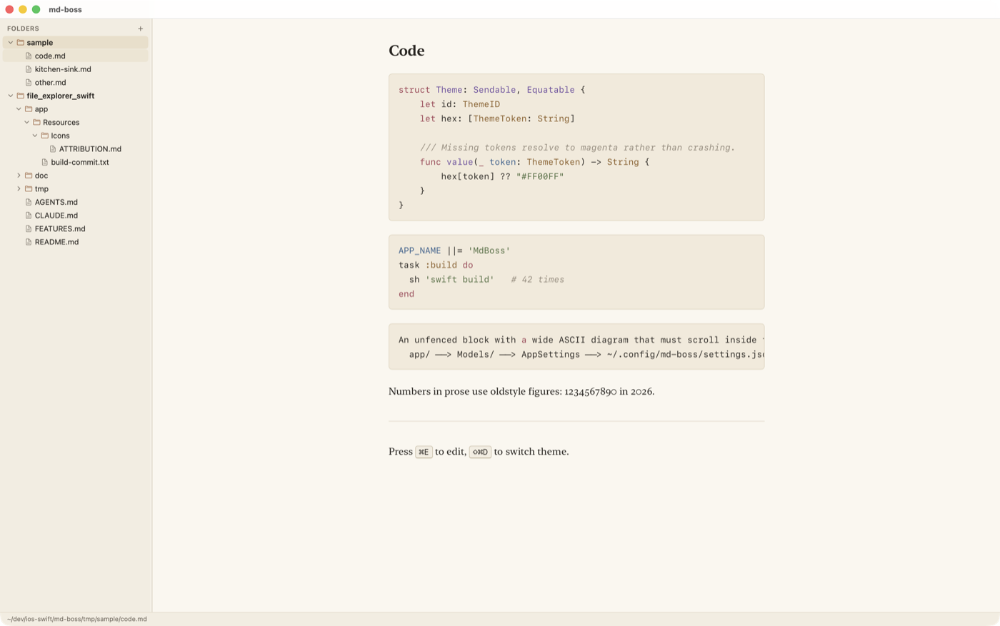
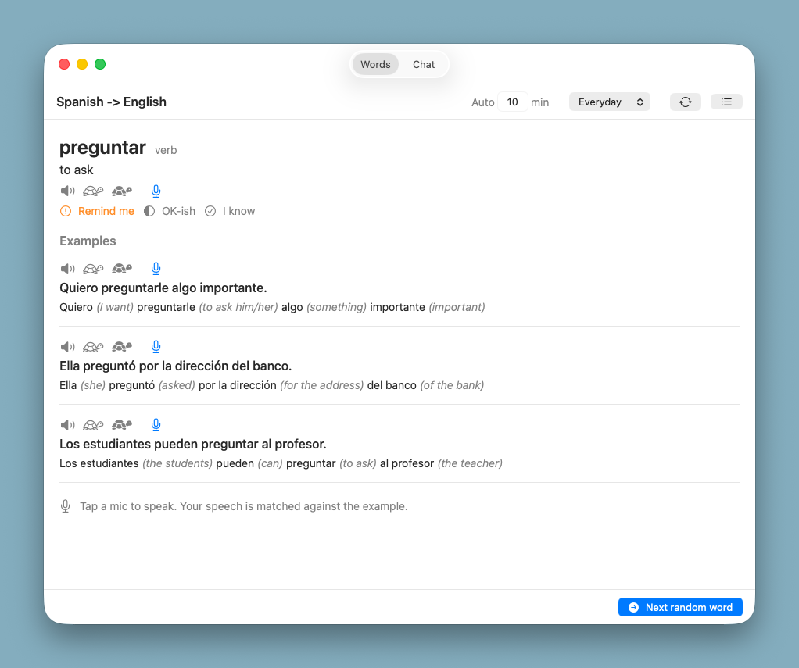
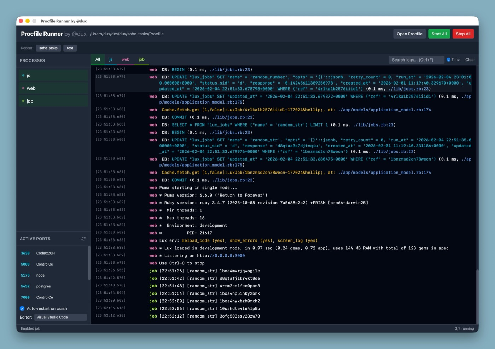

# Hi, I'm Dino 👋

I build things, mostly in **Ruby**, **JavaScript**, **Go** and lately **Swift**.
Comfortable with AWS, Docker, Postgres/MySQL, Snowflake and whatever else the job needs.

I like small libraries with no magic, DSLs you can read out loud, and native apps that start instantly.
Still learning, junior developer for life 🙂

Below is the stuff I actually use. Hope you find something useful.

---

## 💎 Ruby

<table>
<tr><td width="90" align="center"></td><td>

### [lux-fw](https://github.com/dux/lux-fw)

A Ruby web framework that unifies the primitives an enterprise backend actually needs, so you (and your LLM) learn one DSL and use it everywhere.
Sinatra speed, Rails features, Rack + Sequel + PostgreSQL.

</td></tr>
<tr><td width="90" align="center"></td><td>

### [egoist](https://github.com/dux/egoist)

Access policy library. A cleaner Pundit alternative - policies read like sentences and stay out of your models.

</td></tr>
<tr><td width="90" align="center"></td><td>

### [joshua](https://github.com/dux/joshua)

Framework-agnostic REST / JSON-RPC API layer.
Define an action once, get both protocols plus docs and validation for free.

</td></tr>
<tr><td width="90" align="center"></td><td>

### [view-cell](https://github.com/dux/view-cell)

Explicit, straightforward view components for Rails / Sinatra / Lux.
No implicit lookups, no surprises.

</td></tr>
</table>

#### Gems

| Name | Description |
| - | - |
| [hammer](https://github.com/dux/hammer) | The bastard Frankenstein child of Rake, Thor and Joshua. Drop a `Hammerfile`, run `hammer`, ship |
| [typero](https://github.com/dux/typero) | Type system with value coercion and constraints |
| [clean-mock](https://github.com/dux/clean-mock) | Lightweight FactoryBot alternative, similar interface, no magic |
| [json-exporter](https://github.com/dux/json-exporter) | Versioned JSON data exporter with nested object support |
| [html-tag](https://github.com/dux/html-tag) | HTML tag builder on steroids, with Rails / Sinatra / Lux adapters |
| [hash_wia](https://github.com/dux/hash_wia) | Hash with indifferent access - strings, symbols or methods |
| [lux-url](https://github.com/dux/lux-url) | URL object with a few extra features |
| [lux-deploy](https://github.com/dux/lux-deploy) | SSH + rsync deploys. No Docker, no registry, one yaml file |
| [lux_assets](https://github.com/dux/lux_assets) | Web asset packer - simplified webpack/sprockets, convention over configuration |
| [schedulero](https://github.com/dux/schedulero) | Simple Ruby scheduler that runs tasks in intervals |
| [image_resizer](https://github.com/dux/image_resizer) | Fast and stable Ruby image resizer |
| [lux-plugins](https://github.com/dux/lux-plugins) | My personal Lux plugin collection |
| [clean-annotations](https://github.com/dux/clean-annotations) | Annotatable attributes and callbacks for non-Rails classes |
| [class-mattr](https://github.com/dux/class-mattr) | Set and get method attributes |
| [class-cattr](https://github.com/dux/class-cattr) | Class properties, in a non-polluting way |
| [class-callbacks](https://github.com/dux/class-callbacks) | Rails-style callbacks for non-Rails projects |

---

## 🍎 Mac apps

###  FileExplorer

<table><tr><td width="62%">

</td><td width="38%" valign="top">

Native macOS Finder replacement, written in Swift + SwiftUI.
Fast, keyboard-driven, and it previews basically everything.

* Column browser with a live preview pane
* VSCode-style file and folder icons
* Image resize / convert built right in
* Pinned folders, color labels, iPhone file management

[Repo](https://github.com/dux/file_explorer_swift) · [Demo page](https://dux.github.io/file_explorer_swift/web-demo/)

</td></tr></table>

###  App Launcher

<table><tr><td width="62%">

</td><td width="38%" valign="top">

Spotlight-like launcher for macOS, minus the parts of Spotlight nobody asked for.

* Fuzzy app search, instant results
* Run your own scripts from the same box
* Small, native, no Electron anywhere near it

[Repo](https://github.com/dux/app-launcher) · [Home page](https://dux.github.io/app-launcher/)

</td></tr></table>

###  md-boss

<table><tr><td width="62%">

</td><td width="38%" valign="top">

A macOS markdown viewer and editor that looks like paper.
Folders on the left, the rendered document on the right.

* Raw / preview / notes panes side by side
* Raw and preview scroll together, anchored on source lines
* Eight themes, `⇧⌘D` to flip light and dark
* `<` and `>` narrow and widen the reading column

[Repo](https://github.com/dux/md-boss)

</td></tr></table>

###  Friendly Lang Tutor

<table><tr><td width="62%">

</td><td width="38%" valign="top">

A privacy-first macOS language tutor.
Think "LingoBar, but better" - real listening, speaking and pronunciation feedback.

* Everything runs locally
* TTS + STT + pronunciation scoring
* No account, no cloud, no tracking

[Repo](https://github.com/dux/simple-lang-learner)

</td></tr></table>

###  Procfile Runner

<table><tr><td width="62%">

</td><td width="38%" valign="top">

Desktop GUI for the processes in your `Procfile`.
Built with [Wails](https://wails.io/) (Go + JS), so it stays tiny.

* Start / stop / restart each process on its own
* Batch control for the whole file
* Live log output per process

[Repo](https://github.com/dux/procfile-runner)

</td></tr></table>

---

## ⚡ JavaScript / TypeScript

<table>
<tr><td width="90" align="center"></td><td>

### [fez](https://github.com/dux/fez)

[Svelte](https://svelte.dev/)-inspired [custom elements](https://developer.mozilla.org/en-US/docs/Web/API/Web_components/Using_custom_elements), at runtime - no compile step.
Reactive state, scoped styles, zero dependencies.

</td></tr>
</table>

| Name | Description |
| - | - |
| [postwind](https://github.com/dux/postwind) | Tailwind v4 runtime extension in ~500 lines. Pipe responsive (`p-4\|8`), unit suffixes, shortcuts |
| [cf-resizer](https://github.com/dux/cf-resizer) | Cloudflare image resizer - store on R2, deliver via Workers |
| [jshaml](https://github.com/dux/jshaml) | HAML-like template parser that compiles to render functions |
| [node-notify](https://github.com/dux/node-notify) | Socket notify server, updates over socket or web |
| [dux-pjax](https://github.com/dux/dux-pjax) | Small PJAX helper for server-rendered navigation and targeted refreshes |

---

## 🐹 Go

| Name | Description |
| - | - |
| [image-resizer-golang](https://github.com/dux/image-resizer-golang) | AVIF-first resizing service. Two-layer cache, worker pool with request coalescing, admin dashboard |
| [procfile-runner](https://github.com/dux/procfile-runner) | Procfile GUI, Go + Wails - see [Mac apps](#-mac-apps) above |

---

## 🔧 CLI tools

| Name | Description |
| - | - |
| [cf-api](https://github.com/dux/cf-api) | One CLI for the full Cloudflare API. Replaces wrangler + flarectl + curl |
| [hammer](https://github.com/dux/hammer) | Task runner with Rake-style paths and Thor-style args. LLMs love it |
| [lux-deploy](https://github.com/dux/lux-deploy) | Caddy + systemd atomic-release deploys, driven by one yaml file |

---

## 🎮 Just for fun

| Name | Description |
| - | - |
| [populous_game](https://github.com/dux/populous_game) | Populous, rebuilt in Godot |
| [svelte-snake](https://github.com/dux/svelte-snake) | Snake, because Svelte was fun ([play it](https://svelte.dev/playground/2574bf0976334935a3b4755f8858b461?version=3.46.1)) |
